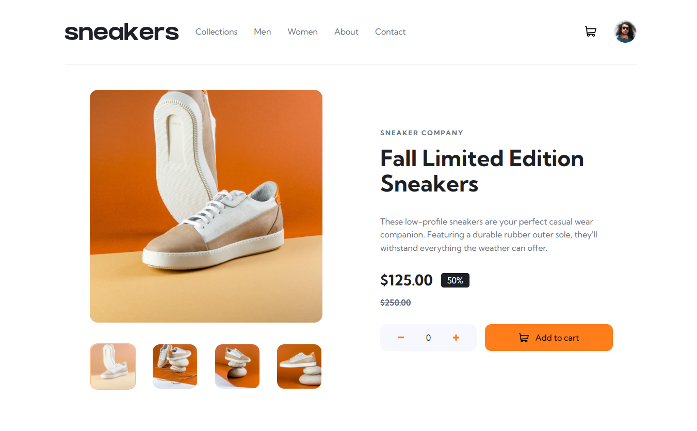

# Frontend Mentor - Weather app solution

This is a solution to the [Weather app challenge on Frontend Mentor](https://www.frontendmentor.io/challenges/weather-app-K1FhddVm49). Frontend Mentor challenges help you improve your coding skills by building realistic projects. 

## Table of contents

- [Overview](#overview)
  - [The challenge](#the-challenge)
  - [Screenshot](#screenshot)
  - [Links](#links)
- [My process](#my-process)
  - [Built with](#built-with)
  - [Useful resources](#useful-resources)
- [Author](#author)

## Overview

### The challenge

Users should be able to:

- Open a lightbox gallery by clicking on the large product image
- Switch the large product image by clicking on the small thumbnail images
- Add items to the cart
- View the cart and remove items from it
- View the optimal layout for the site depending on their device's screen size
- See hover states for all interactive elements on the page

### Screenshot

### Links

- GitHub URL: [https://github.com/xaoccc/E-commerce](https://github.com/xaoccc/E-commerce)
- Live Site URL: 

## My process

### Built with

- Semantic HTML5 markup
- CSS custom properties
- Flexbox
- [Svelte](https://svelte.dev/) - JS library

### Useful resources

- [Svelte](https://svelte.dev/)
- [chatGPT](https://chatgpt.com/)
- [Netlify](https://www.netlify.com/)

### Challenges

- Changing between the items on click.
- Showing the cart with the corresponding data.
- Making the data readable from a db.json.
- Styling the small images when active. Not active in a html way, but active as UX.
- Making the arrows on the light box and their functionality.

## Author

- Frontend Mentor - [@xaoccc](https://www.frontendmentor.io/profile/xaoccc)

